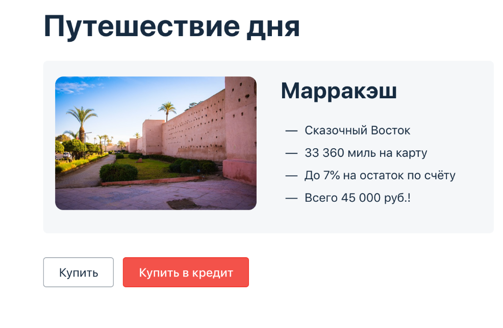

## План автоматизации тестирования

### 1. Перечень автоматизируемых сценариев.

*Предусловие*: 
1. Открыто приложение для покупки тура http://localhost:8080/

2. В IntelliJ IDEA через терминал запущен файл aqa-shop.jar
3. Открыта база данных для проверки записей (например DBeaver)

**Тестовые (валидные) данные:**

При вводе данных карт в поля для заполнения во вкладке "Купить" и "Купить в кредит" корректными данными считаются:

1. Поле "Номер карты"
-  16 арабских цифр в формате **** **** **** **** , например, 4444 4444 4444 4441
2. Поле "Месяц"
- последние 2 цифры текущего месяца (значения от 01  до 12), если год стоит текущий, то не меньше текущего месяца, например 12
3. Поле "Год"
- последние 2 цифры текущего года, но не ранее, чем год заполнения и не позднее 5 лет от года заполнения, например: 23
4. Поле "Владелец"
- латинница, не меньше 2х символов, например: Ivanov Ivan
5. Поле "CVC"
- трехзначное арабское число в формате (***), например, 999

**Номера карт, для тестирования:**

- 4444 4444 4444 4441, status APPROVED
- 4444 4444 4444 4442, status DECLINED

**Позитивные сценарии:**

1. а) Успешная покупка тура картой со статусом APPROVED

- Нажать "Купить"
- Ввести в поля формы валидные данные
- Нажать "Продолжить"
- Сделать запрос из таблицы payment_entity статус последней операции.

*Ожидаемый результат:* Форма отправлена. Оплата проходит(данные об оплате появляются в таблице payment_entity операция со статусом APPROVED). Выходит сообщение "Успешно. Операция одобрена Банком."

б) Успешная покупка тура в кредит картой со статусом APPROVED

- Нажать "Купить в кредит"
- Ввести в поля формы валидные данные
- Нажать "Продолжить"
- Сделать запрос из таблицы credit_request_entity статус последней операции.

*Ожидаемый результат:* Форма отправлена. Оплата проходит. Выходит сообщение "Успешно. Операция одобрена Банком." Данные об оплате появляются в таблице credit_request_entity операция со статусом APPROVED

**Негативные сценарии:**

1. а) Покупка тура картой со статусом DECLINED
- Нажать "Купить"
- Ввести в поля формы валидные данные
- Нажать "Продолжить"
- Сделать запрос из таблицы payment_entity статус последней операции.

*Ожидаемый результат:* Форма отправлена. Оплата не проходит. Выходит сообщение об ошибке "Ошибка!Банк отказал в проведении операции." В базе данных в таблице payment_entity операция со статусом DECLINED.

б) Покупка тура в кредит картой со статусом DECLINED
- Нажать "Купить в кредит"
- Ввести в поля формы валидные данные
- Нажать "Продолжить"
- Сделать запрос из таблицы credit_request_entity статус последней операции.

*Ожидаемый результат:* Форма отправлена. Оплата не проходит. Выходит сообщение об ошибке "Ошибка!Банк отказал в проведении операции." В базе данных в таблице credit_request_entity операция со статусом DECLINED.

2. а) Отправка формы с невалидными данными в поле "Номер карты" (11 арабских цифр) при оплате тура по карте
- В поле "Номер карты" ввести символы меньше стандартного набора - 11 арабских цифр, например: 4444 4444 4444 444.
- Остальные поля формы заполнить валидными данными.
- Нажать "Продолжить"

*Ожидаемый результат:* Форма не отправлена. Под полем "Номер карты" появляется сообщение об ошибке "Неверный формат".

б) Отправка формы с невалидными данными в поле "Номер карты" (11 арабских цифр) при покупке тура в кредит по данным карты
- В поле "Номер карты" ввести символы меньше стандартного набора - 11 арабских цифр, например: 4444 4444 4444 444.
- Остальные поля формы заполнить валидными данными.
- Нажать "Продолжить"

*Ожидаемый результат:* Форма не отправлена. Под полем "Номер карты" появляется сообщение об ошибке "Неверный формат".

4. а) Отправка формы с невалидными данными в поле "Номер карты" (17 арабских цифр) при оплате тура по карте
- В поле "Номер карты" ввести символы больше стандартного набора - 17 арабских цифр, например: 4444 4444 4444 4441 3.
- Остальные поля формы заполнить валидными данными.
- Нажать "Продолжить"

*Ожидаемый результат:* В поле "Номер карты" не дает ввести цифры количеством больше 16.

б) Отправка формы с невалидными данными в поле "Номер карты" (17 арабских цифр) при покупке тура в кредит по данным карты
- В поле "Номер карты" ввести символы больше стандартного набора - 17 арабских цифр, например: 4444 4444 4444 4441 3.
- Остальные поля формы заполнить валидными данными.
- Нажать "Продолжить"

*Ожидаемый результат:* В поле "Номер карты" не дает ввести цифры количеством больше 16.

5. а) Отправка формы с невалидными данными в поле "Месяц" (однозначное числовое значение) при оплате тура по карте
- В поле "Месяц" ввести данные из 1 числового значения (например 2)
- Остальные поля формы заполнить валидными данными.
- Нажать "Продолжить"

  *Ожидаемый результат:* Форма не отправлена. Под полем "Месяц" появляется сообщение об ошибке "Неверный формат".

б) Отправка формы с невалидными данными в поле "Месяц" (однозначное числовое значение) при покупке тура в кредит по данным карты
- В поле "Месяц" ввести данные из 1 числового значения (например 2)
- Остальные поля формы заполнить валидными данными.
- Нажать "Продолжить"

  *Ожидаемый результат:* Форма не отправлена. Под полем "Месяц" появляется сообщение об ошибке "Неверный формат".

6. а) Отправка формы с невалидными данными в поле "Месяц" (данные из нулей) при оплате тура по карте
- В поле "месяц" ввести данные из нулей ("00")
- Остальные поля формы заполнить валидными данными.
- Нажать "Продолжить"

*Ожидаемый результат:* Форма не отправлена. Под полем "Месяц" появляется сообщение об ошибке "Неверно указан срок действия карты".

б) Отправка формы с невалидными данными в поле "Месяц" (данные из нулей) при покупке тура в кредит по данным карты
- В поле "Месяц" ввести данные из нулей ("00")
- Остальные поля формы заполнить валидными данными.
- Нажать "Продолжить"

*Ожидаемый результат:* Форма не отправлена. Под полем "Месяц" появляется сообщение об ошибке "Неверно указан срок действия карты".

7. а) Отправка формы с невалидными данными в поле "Месяц" (число больше 12) при покупке тура по карте
- В поле "Месяц" ввести значение "13"
- Остальные поля формы заполнить валидными данными.
- Нажать "Продолжить"

*Ожидаемый результат:* Форма не отправлена. Под полем "Месяц" появляется сообщение об ошибке "Неверно указан срок действия карты".

б) Отправка формы с невалидными данными в поле "Месяц" (число больше 12) при покупке тура в кредит по данным карты
- В поле "Месяц" ввести значение "13"
- Остальные поля формы заполнить валидными данными.
- Нажать "Продолжить"

*Ожидаемый результат:* Форма не отправлена. Под полем "Месяц" появляется сообщение об ошибке "Неверно указан срок действия карты".

8. а) Отправка формы с невалидными данными в поле "Год" (данные из нулей) при покупке тура по карте
- В поле "Год" ввести данные из нулей ("00")
- Остальные поля формы заполнить валидными данными.
- Нажать "Продолжить"

*Ожидаемый результат:* Форма не отправлена. Под полем "Год" появляется сообщение об ошибке "Истёк срок действия карты".

б) Отправка формы с невалидными данными в поле "Год" (данные из нулей) при покупке тура в кредит по данным карты
- В поле "Год" ввести данные из нулей ("00")
- Остальные поля формы заполнить валидными данными.
- Нажать "Продолжить"

*Ожидаемый результат:* Форма не отправлена. Под полем "Год" появляется сообщение об ошибке "Истёк срок действия карты".

9. а) Отправка формы с невалидными данными в поле "Год" (больше 5 лет от года заполнения) при покупке тура по карте
- В поле "Год" ввести цифру превышающую 5 лет от года заполнения (например: 30)
- Остальные поля формы заполнить валидными данными.
- Нажать "Продолжить"

*Ожидаемый результат:* Форма не отправлена. Под полем "Год" появляется сообщение об ошибке "Неверно указан срок действия карты".

б) Отправка формы с невалидными данными в поле "Год" (больше 5 лет от года заполнения) при покупке тура в кредит по данным карты
- В поле "Год" ввести цифру превышающую 5 лет от года заполнения (например: 30)
- Остальные поля формы заполнить валидными данными.
- Нажать "Продолжить"

*Ожидаемый результат:* Форма не отправлена. Под полем "Год" появляется сообщение об ошибке "Неверно указан срок действия карты".

10. а) Отправка формы с невалидными данными в поле "Год" (однозначное числовое значение) при оплате тура по карте
- В поле "Год" ввести данные из 1 числового значения (например 3)
- Остальные поля формы заполнить валидными данными.
- Нажать "Продолжить"

  *Ожидаемый результат:* Форма не отправлена. Под полем "Год" появляется сообщение об ошибке "Неверный формат".

б) Отправка формы с невалидными данными в поле "Год" (однозначное числовое значение) при покупке тура в кредит по данным карты
- В поле "Год" ввести данные из 1 числового значения (например 3)
- Остальные поля формы заполнить валидными данными.
- Нажать "Продолжить"

  *Ожидаемый результат:* Форма не отправлена. Под полем "Год" появляется сообщение об ошибке "Неверный формат".

  11. а) Отправка формы с невалидными данными в поле "Год" (прошлый год) при оплате тура по карте
- В поле "Год" ввести 2 последние цифры прошлого года (например 22)
- Остальные поля формы заполнить валидными данными.
- Нажать "Продолжить"

  *Ожидаемый результат:* Форма не отправлена. Под полем "Год" появляется сообщение об ошибке "Истек срок действия карты".

б) Отправка формы с невалидными данными в поле "Год" (прошлый год) при покупке тура в кредит по данным карты
- В поле "Год" ввести 2 последние цифры прошлого года (например 22)
- Остальные поля формы заполнить валидными данными.
- Нажать "Продолжить"

  *Ожидаемый результат:* Форма не отправлена. Под полем "Год" появляется сообщение об ошибке "Истек срок действия карты".

11. а) Отправка формы с невалидными данными в поле "Владелец" (значение на кириллице) при покупке тура по карте
- В поле "Владелец" ввести значение на кириллице (например: Иванов)
- Остальные поля формы заполнить валидными данными.
- Нажать "Продолжить"

*Ожидаемый результат:* Форма не отправлена. Под полем "Владелец" появляется сообщение об ошибке "Неверный формат".

б) Отправка формы с невалидными данными в поле "Владелец" (значение на кириллицей) при покупке тура в кредит по данным карты
- В поле "Владелец" ввести значение на кириллице (например: Иванов)
- Остальные поля формы заполнить валидными данными.
- Нажать "Продолжить"
 *Ожидаемый результат:* Форма не отправлена. Под полем "Владелец" появляется сообщение об ошибке "Неверный формат".

12. а) Отправка формы с невалидными данными в поле "Владелец" (цифры, спец символы) при покупке тура по карте
- В поле "Владелец" ввести значение из цифр/спец символов (например:123@)
- Остальные поля формы заполнить валидными данными.
- Нажать "Продолжить"

*Ожидаемый результат:* Форма не отправлена. Под полем "Владелец" появляется сообщение об ошибке "Неверный формат".

б) Отправка формы с невалидными данными в поле "Владелец" (цифры, спец символы)  при покупке тура в кредит по данным карты
- В поле "Владелец" ввести значение из цифр/спец символов/иероглифов (например:123@)
- Остальные поля формы заполнить валидными данными.
- Нажать "Продолжить"

*Ожидаемый результат:* Форма не отправлена. Под полем "Владелец" появляется сообщение об ошибке "Неверный формат".

13. а) Отправка формы с невалидными данными в поле "Владелец" (один символ на латинице) при покупке тура по карте
- В поле "Владелец" ввести значение на латинице (например:N)
- Остальные поля формы заполнить валидными данными.
- Нажать "Продолжить"

*Ожидаемый результат:* Форма не отправлена. Под полем "Владелец" появляется сообщение об ошибке "Неверный формат".

б) Отправка формы с невалидными данными в поле "Владелец" (один символ на латиниц)  при покупке тура в кредит по данным карты
- В поле "Владелец" ввести значение на латинице (например:N)
- Остальные поля формы заполнить валидными данными.
- Нажать "Продолжить"

*Ожидаемый результат:* Форма не отправлена. Под полем "Владелец" появляется сообщение об ошибке "Неверный формат".

14. а) Отправка формы с невалидными данными в поле "CVC/CVV"(менее 3х символов) при покупке тура по карте 
- В поле "CVC/CCV" ввести данные из меньшего количества стандартного набора символов (менее 3х символов). Например:06
- Остальные поля формы заполнить валидными данными.
- Нажать "Продолжить"

*Ожидаемый результат:* Форма не отправлена. Под полем "CVC/CVV" появляется сообщение об ошибке "Неверный формат".

б)  Отправка формы с невалидными данными в поле "CVC/CVV"(менее 3х символов) при покупке тура в кредит по данным карты
- В поле "CVC/CCV" ввести данные из меньшего количество стандартного набора символов (менее 3). Например:06
- Остальные поля формы заполнить валидными данными.
- Нажать "Продолжить"

*Ожидаемый результат:* Форма не отправлена. Под полем "CVC/CVV" появляется сообщение об ошибке "Неверный формат".

15. а) Отправка формы с невалидными данными в поле "CVC/CVV" (данные из нулей) при покупке тура по карте
- В поле "CVC/CVV" ввести данные из нулей ("000")
- Остальные поля формы заполнить валидными данными.
- Нажать "Продолжить"

*Ожидаемый результат:* Форма не отправлена. Под полем "CVC/CVV" появляется сообщение об ошибке "Неверный формат".

б) Отправка формы с невалидными данными в поле "CVC/CVV" (данные из нулей) при покупке тура в кредит по данным карты
- В поле "CVC/CVV"  ввести данные из нулей ("000")
- Остальные поля формы заполнить валидными данными.
- Нажать "Продолжить"

*Ожидаемый результат:* Форма не отправлена. Под полем "CVC/CVV" появляется сообщение об ошибке "Неверный формат".

16. а) Отправка формы с невалидными данными в поле "CVC/CVV" (более 3х символов) при покупке тура по карте
- В поле "CVC/CVV" ввести 4 цифры ("0546")
- Остальные поля формы заполнить валидными данными.
- Нажать "Продолжить"

*Ожидаемый результат:* В поле "CVC/CVV" не дает ввести цифры количеством больше 3.

б) Отправка формы с невалидными данными в поле "CVC/CVV" (более 3х символов) при покупке тура в кредит по данным карты
- В поле "CVC/CVV"  ввести 4 цифры ("0546")
- Остальные поля формы заполнить валидными данными.
- Нажать "Продолжить"

*Ожидаемый результат:* В поле "CVC/CVV" не дает ввести цифры количеством больше 3.

17. а) Отправка формы с пустым полем "Номер карты" при покупке тура по карте
- Оставить пустым поле "Номер карты"
- Остальные поля формы заполнить валидными данными.
- Нажать "Продолжить"

*Ожидаемый результат:* Форма не отправлена. Под полем "Номер карты" появляется сообщение об ошибке "Неверный формат".

б) Отправка формы с пустым полем "Номер карты" при покупке тура в кредит по данным карты
- Оставить пустым поле "Номер карты"
- Остальные поля формы заполнить валидными данными.
- Нажать "Продолжить"

*Ожидаемый результат:* Форма не отправлена. Под полем "Номер карты" появляется сообщение об ошибке "Неверный формат".

18. а) Отправка формы с пустым полем "Месяц" при покупке тура по карте
- Оставить пустым поле "Месяц"
- Остальные поля формы заполнить валидными данными.
- Нажать "Продолжить"

*Ожидаемый результат:* Форма не отправлена. Под полем "Месяц" появляется сообщение об ошибке "Неверный формат".

б) Отправка формы с пустым полем "Месяц" при покупке тура в кредит по данным карты
- Оставить пустым поле "Месяц"
- Остальные поля формы заполнить валидными данными.
- Нажать "Продолжить"

*Ожидаемый результат:* Форма не отправлена. Под полем "Месяц" появляется сообщение об ошибке "Неверный формат".

19. а) Отправка формы с пустым полем "Год" при покупке тура по карте
- Оставить пустым поле "Год"
- Остальные поля формы заполнить валидными данными.
- Нажать "Продолжить"

*Ожидаемый результат:* Форма не отправлена. Под полем "Год" появляется сообщение об ошибке "Неверный формат".

б) Отправка формы с пустым полем "Год" при покупке тура в кредит по данным карты
- Оставить пустым поле "Год"
- Остальные поля формы заполнить валидными данными.
- Нажать "Продолжить"

*Ожидаемый результат:* ОФорма не отправлена. Под полем "Год" появляется сообщение об ошибке "Неверный формат".

20. а) Отправка формы с пустым полем "Владелец" при покупке тура по карте
- Оставить пустым поле "Владелец"
- Остальные поля формы заполнить валидными данными.
- Нажать "Продолжить"

*Ожидаемый результат:* Форма не отправлена. Под полем "Владелец" появляется сообщение об ошибке "Поле обязательно для заполнения".

б) Отправка формы с пустым полем "Владелец" при покупке тура в кредит по данным карты
- Оставить пустым поле "Владелец"
- Остальные поля формы заполнить валидными данными.
- Нажать "Продолжить"

*Ожидаемый результат:* Форма не отправлена. Под полем "Владелец" появляется сообщение об ошибке "Поле обязательно для заполнения".

21. а) Отправка формы с пустым полем "CVC/CVV" при покупке тура по карте
- Оставить пустым поле "CVC/CVV"
- Остальные поля формы заполнить валидными данными.
- Нажать "Продолжить"

*Ожидаемый результат:* Форма не отправлена. Под полем "CVC/CVV" появляется сообщение об ошибке "Неверный формат".

б) Отправка формы с пустым полем "CVC/CVV" при покупке тура в кредит по данным карты
- Оставить пустым поле "CVC/CVV"
- Остальные поля формы заполнить валидными данными.
- Нажать "Продолжить"

*Ожидаемый результат:* Форма не отправлена. Под полем "CVC/CVV" появляется сообщение об ошибке "Неверный формат".

22. а) Отправка формы с пустыми полями при покупке тура по карте
- Оставить все поля пустыми
- Нажать "Продолжить"

*Ожидаемый результат:* Форма не отправлена. Сообщение об ошибке под каждым полем ("Неверный формат") кроме поля "Владелец", под полем "Владелец" сообщение "Поле обязательно для заполнения").

б) Отправка формы с пустыми полями при покупке тура в кредит по данным карты
- Оставить все поля пустыми
- Нажать "Продолжить"

*Ожидаемый результат:* Форма не отправлена. Сообщение об ошибке под каждым полем ("Неверный формат") кроме поля "Владелец", под полем "Владелец" сообщение "Поле обязательно для заполнения").

23. а) Успешная отправка запроса в базу данных при оплате тура картой со статусом APPROVED

- Заполнить форму "Купить" валидными данными
- Нажать "Продолжить"
- Получить сообщение "Успешно. Операция одобрена Банком."
- Сделать запрос из таблицы payment_entity статус последней операции.

*Ожидаемый результат:* В базе данных в таблице payment_entity операция со статусом APPROVED.

б) Успешная отправка запроса в базу данных при покупке тура в кредит картой со статусом APPROVED

- Заполнить форму "Купить в кредит" валидными данными
- Нажать "Продолжить"
- Получить сообщение "Успешно. Операция одобрена Банком."
- Сделать запрос из таблицы credit_request_entity статус последней операции.

*Ожидаемый результат:* В базе данных в таблице credit_request_entity операция со статусом APPROVED.

24.  а) Отправка запроса в базу данных при оплате тура картой со статусом DECLINED
- Заполнить форму "Купить" валидными данными
- Нажать "Продолжить"
- Получить сообщение "Успешно. Операция одобрена Банком."
- Сделать запрос из таблицы payment_entity статус последней операции.

*Ожидаемый результат:* В базе данных в таблице payment_entity операция со статусом DECLINED.

б) Отправка запроса в базу данных при покупке тура в кредит картой со статусом DECLINED
- Заполнить форму "Купить в кредит" валидными данными
- Нажать "Продолжить"
- Получить сообщение "Успешно. Операция одобрена Банком."
- Сделать запрос из таблицы credit_request_entity статус последней операции.

*Ожидаемый результат:* В базе данных в таблице credit_request_entity операция со статусом DECLINED.
___

### 2. Перечень используемых инструментов с обоснованием выбора

___
1. JDK (Java Development Kit) - набор программ для разработки на языке Java. Он включает в себя JRE, загрузчик кода java, компилятор javac, архиватор jar, 
генератор документации javadoc и другие утилиты, нужные во время разработки.;
2. Faker — это библиотека, которая позволяет генерировать случайные данные. С ее помощью можно заполнить таблицы в базе данных, построить корректные XML-документы, 
сформировать JSON-ответы для REST
3. Gradle - инструмент автоматизации сборки и управления зависимостями;
4. JUnit5 — платформа для написания авто-тестов и их запуска;
5. Selenide - фреймворк для автоматизированного тестирования веб-приложений, созданный на основе Selenium WebDriver, удобный и простой в использовании. 
Одной из главных проблем при тестировании веб-приложений является ожидание изменений в DOM-структуре и загрузки AJAX-контента. 
Selenide решает эту проблему путем автоматического ожидания элементов и проверки их состояния. Это упрощает написание тестов и делает их более стабильными.
6. Docker - инструмент, позволяющий запускать контейнеры, автоматизировать их запуск и развертывание, управляет жизненным циклом.
7. Allure - фреймворк, предназначенный для создания отчетов и визуализации тестирования;
8. Lombok- библиотека для сокращения количества шаблонного кода, для объявления локальной переменной вместо указания реального типа;
9. Git и GitHub для хранения кода. Git достаточно прост и удобен для управления исходным кодом, очень распространенная система контроля версий, поэтому достаточно хорошо взаимодействует с различными ОС. GitHub специализированный веб-сервис с удобным интерфейсои, интегрирован с Git.
10.  Postman - инструмент, предназначенный для тестирования веб-сервисов API
11.  DevTools — набор инструментов разработчика в браузерах, которые помогают в создании, тестировании, оптимизации и отладки сайтов.
12.  DBeaver - приложение, предназначенное для управления базами данных.

___

### 3. Перечень и описание возможных рисков при автоматизации

___

- Отсутствие достаточного опыта в использовании программ
- Отсутствие документации по описанию работы приложения
- Трудности при подборе инструментов, необходимых для автоматизированного тестирования.
- Проблемы с запуском приложения, подключением БД
- Технические неполадки компьютерной техники
- Увеличение времени тестирования
- Увеличение стоимости тестирования
- Проблемы со здоровьем

___

### 4. Интервальная оценка с учётом рисков (в часах)

___

- Написание плана тестирования - 8 часов
- Подготовка тестовой среды, настройка инструментов - 8 часов
- Написание автотестов - 24 часа
- Прогон автотестов - 4 часа
- Составление баг-репортов - 16 часов
- Составление отчетов о тестировании - 12 часов
  
  *Итого:* 72 часа

---

### 5. План сдачи работ

___

- Aвтотесты: до 14.12.2023
- Заведение баг репортов - до 17.12.2023
- Отчет по итогам тестирования - 19.12.2023
- Отчет по итогам автоматизации - 21.12.2023
